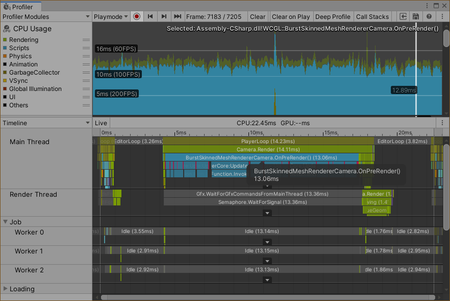
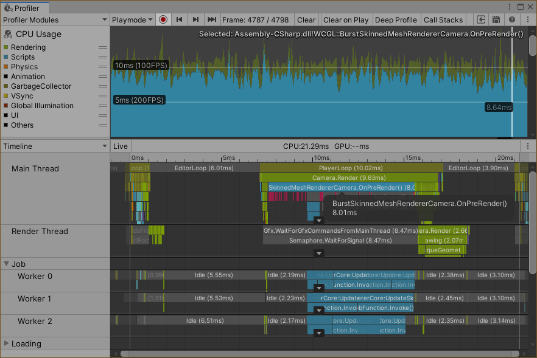
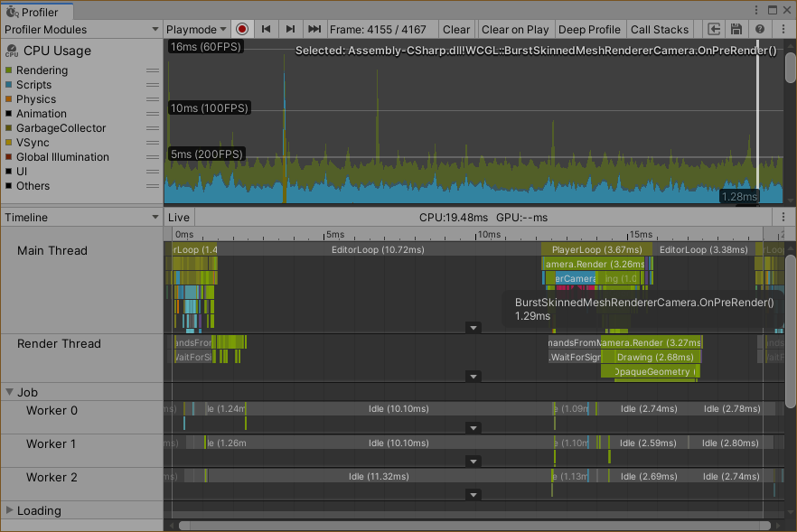

# BurstSkinnedMeshRendererSample

[BurstSkinnedMeshRenderer](https://github.com/takeshi-okuya/BurstSkinnedMeshRenderer)のサンプル用プロジェクトです。

自前でスキン行列を計算（Burstコンパイラーで高速化）し、シェーダで利用しています。
何らかの事情でSkinnedMeshRendererが使えないときに代替手段としてスキニングが可能なレンダラーです。

## 想定される用途
* CommandBuffer で描画のタイミングを制御
* パス毎にトポロジーを変更
* 群衆アニメーションで同じポーズを同時に複数利用

## 速度比較

Core i5-6200U（2.30GHz 4スレッド）にて計測。

### 普通にメインスレッドでスキン行列を生成 約13 ms

### C# Job System を利用 約8.0 ms

### C# Job System と Burst コンパイラーを利用（このリポジトリ） 約1.3 ms

